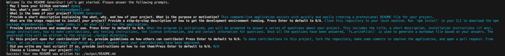

# README Generator  

## Description 
When creating an open source project on GitHub, it’s important to have a high-quality README for the app. This should include what the app is for, how to use the app, how to install it, how to report issues, and how to make contributions—this last part increases the likelihood that other developers will contribute to the success of the project.  
This command-line application assists with quickly and easily creating a professional README file for your project. 

## Table of Contents 
- [Installation](#Installation)
- [Usage](#Usage)
- [Contributing](#Contributing)
- [Testing](#Testing)
- [License](#License)
- [Questions](#Questions)

## Installation 
1. Clone this repository to your local machine. (For reference, visit the [Cloning a Repository](https://docs.github.com/en/repositories/creating-and-managing-repositories/cloning-a-repository) GitHub Docs article.)
2. Run `npm install` in your CLI to download the npm package dependencies. 
3. Run `node index.js` on your CLI to run the application (You will need [NodeJS](https://nodejs.org/en) installed).

## Usage 
When the program is initialized, you will be prompted to answer a series of questions about your project. This includes the title, a short description, installation instructions (if any), usage instructions, how to make contributions, any testing instructions, the license information, and and contact information for questions.  
Once all the questions have been answered, `fs.writeFile()` is used to generate a markdown file based on your answers. The generated file will be written to the relative ./output directory.  
  
### Screenshot of CLI on Use 

## Contributing
To make contributions to this project:  
1. Fork the repository  
2. Make some commits to improve the application
3. Open a Pull Request on GitHub
4. From there, we can discuss your changes and merge the pull request once your contributions have been approved!

## Testing 
N/A

## License 
This GitHub repository is licensed under the MIT license. Please refer to the license documentation [here](https://opensource.org/licenses/MIT).

## Questions
This project was created by [dymoy](https://github.com/dymoy).  
For any related questions, please contact me via email at <derekymoy@gmail.com>.
